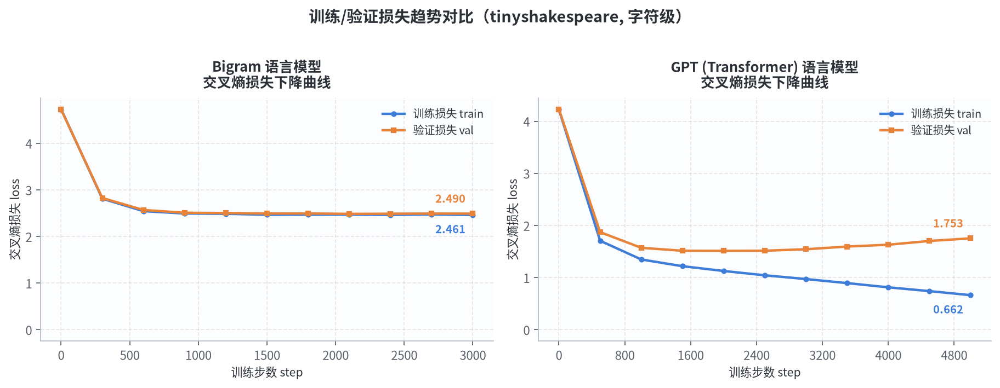
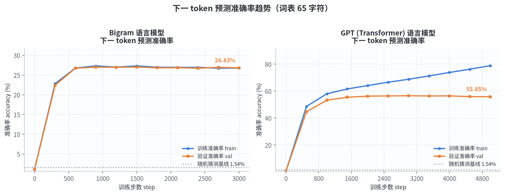
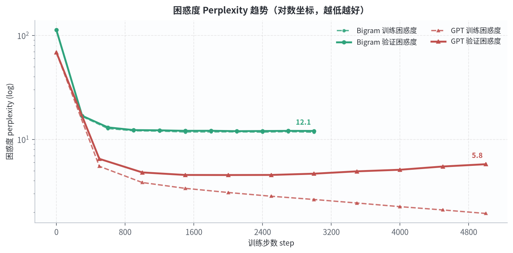
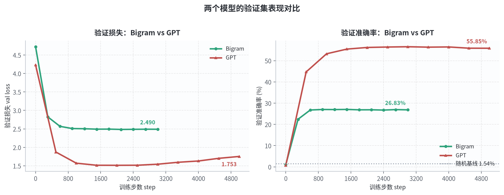
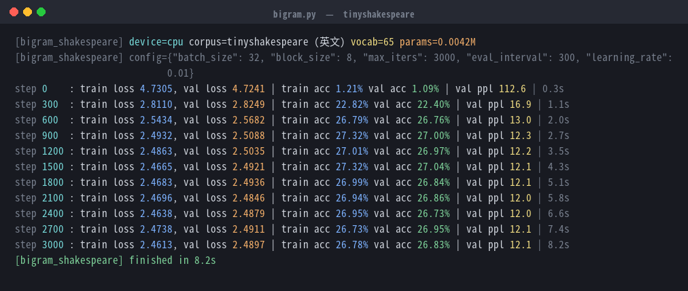
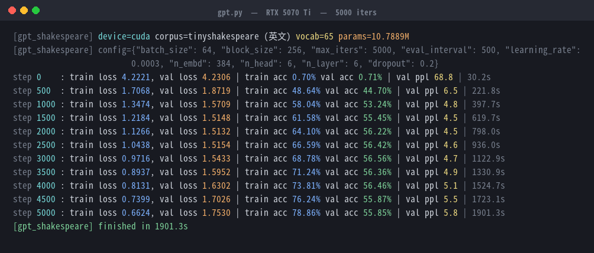
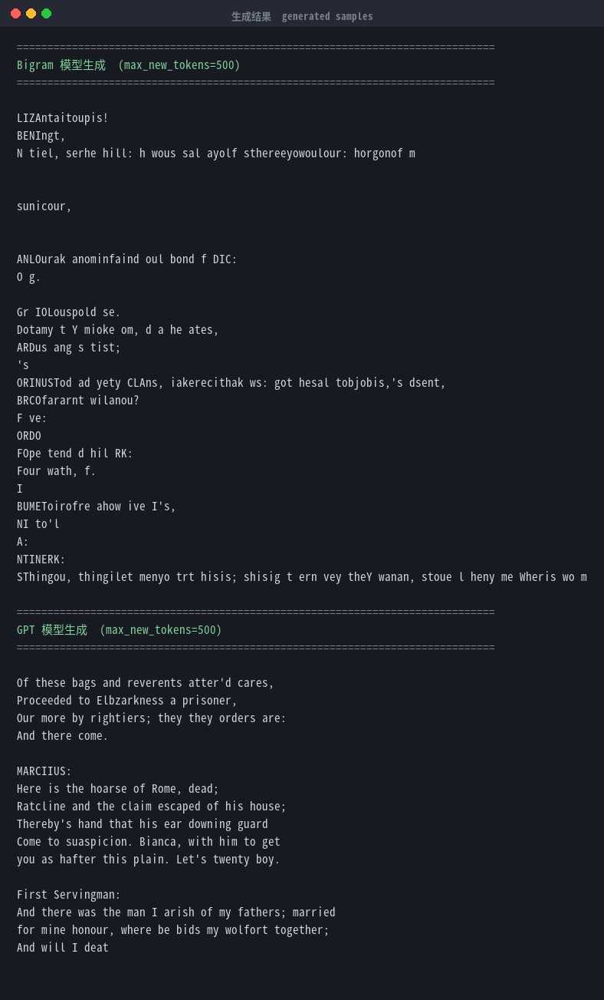

# diy_bigram

从零复现 **Karpathy《Let's build GPT: from scratch, in code, spelled out》** 的字符级语言模型：
先实现一个最简单的 **Bigram** 模型，再逐步搭出完整的 **Transformer (GPT)**，并在
tinyshakespeare 数据集上完成训练与评估。

本项目包含**真实训练数据**、**准确率/损失趋势图表**和**训练日志与生成结果截图**。

---

## 结果速览

| 模型 | 参数量 | 训练步数 | 训练损失 | 验证损失 | 训练准确率 | **验证准确率** | 验证困惑度 | 随机基线 | 训练耗时 |
|---|---|---|---|---|---|---|---|---|---|
| **Bigram** | 0.0042 M | 3000 | 2.4613 | 2.4897 | 26.78 % | **26.83 %** | 12.06 | 1.54 % | 8.2 s (CPU) |
| **GPT (Transformer)** | 10.7889 M | 5000 | 0.6624 | 1.7530 | 78.86 % | **55.85 %** | 5.77 | 1.54 % | 1901.3 s (GPU) |

上表为**最后一次评估（step 5000）**的数值。GPT 的**最优表现**出现在中途：

| GPT 最优指标 | 数值 | 出现位置 |
|---|---|---|
| 最低验证损失 | **1.5132** | step 2000 |
| 最低验证困惑度 | **4.54** | step 2000 |
| 最高验证准确率 | **56.56 %** | step 3000 |

**核心结论**：相比 Bigram，GPT 在最优点的验证损失降低 **39.2 %**（2.4897 → 1.5132）、
困惑度降低 **62 %**（12.06 → 4.54）；验证准确率最高提升 **约 +29.7 个百分点**
（26.83 % → 56.56 %）。Bigram 只能建模相邻两个字符的转移概率，而 Transformer
通过自注意力机制获得了长距离上下文建模能力。


---

## 目录结构

```
diy_bigram/
├── bigram.py                 # Bigram 模型（原始实现，未改动）
├── gpt.py                    # GPT / Transformer 模型（原始实现，未改动）
├── bigram.ipynb              # 学习过程中的 nn.Embedding 实验笔记
├── input.txt                 # 数据集：tinyshakespeare（1,115,394 字符）
├── README.md
└── results/
    ├── *_history.json        # 逐评估点的 loss / ppl / accuracy 记录
    ├── logs/                 # 原始训练日志
    ├── figures/              # 趋势图表 PNG
    └── screenshots/          # 结果截图 PNG
```

> `bigram.py` 与 `gpt.py` 保持原样。所有指标由 `tools/train.py` 在**相同超参数、
> 相同随机种子（1337）**下重新训练并记录得到，以便绘制曲线。

---

## 环境

| 项目 | 版本 |
|---|---|
| Python | 3.11.15 |
| PyTorch | 2.11.0 + cu128 |
| 依赖 | numpy / pandas / matplotlib / Pillow |
| 训练设备 | NVIDIA GeForce RTX 5070 Ti Laptop GPU（12 GB，驱动 572.84） |

---

## 数据集

**tinyshakespeare**（`input.txt`）：

- 总字符数：**1,115,394**
- 字符表大小（vocab_size）：**65**（大小写英文字母、标点、空格、换行）
- 划分：前 90 % 作为训练集（1,003,854 字符），后 10 % 作为验证集（111,540 字符）
- 随机猜测的下一字符准确率基线：**1/65 ≈ 1.54 %**

---

## 模型架构

### 1. Bigram 语言模型（`bigram.py`）

最朴素的语言模型：仅用一张 `Embedding(65, 65)` 查找表建模
`P(next_char | current_char)`。

```python
class BigramLanguageModel(nn.Module):
    def __init__(self, vocab_size):
        super().__init__()
        self.token_embedding_table = nn.Embedding(vocab_size, vocab_size)
```

- 参数量：65 × 65 = **4,225**
- 上下文长度：**1 个字符**（无长距离依赖）
- 训练配置：`batch_size=32, block_size=8, max_iters=3000, lr=1e-2`

### 2. GPT / Transformer（`gpt.py`）

完整的 decoder-only Transformer，包含：

| 组件 | 说明 |
|---|---|
| Token Embedding | `Embedding(65, 384)` |
| Position Embedding | `Embedding(256, 384)` |
| Multi-Head Self-Attention | 6 个注意力头，`head_size = 384/6 = 64`，含因果掩码（下三角） |
| FeedForward | `Linear(384→1536) → ReLU → Linear(1536→384)` |
| Block | Pre-LN 结构：`x = x + sa(ln1(x))`；`x = x + ffwd(ln2(x))`，共 **6 层** |
| 输出层 | `LayerNorm(384) → Linear(384, 65)` |

- 参数量：**10,788,900（10.79 M）**
- 上下文长度：**256 个字符**
- 训练配置：`batch_size=64, block_size=256, max_iters=5000, lr=3e-4, dropout=0.2`

---

## 实验结果

> **指标定义**：**准确率**指「下一 token 预测准确率」，即 `argmax(logits) == target`
> 的字符占比；**困惑度**为 `exp(交叉熵损失)`，越低越好。

### 1. 损失下降趋势



- **Bigram**：损失在 step 600 左右迅速降到 2.5 附近后**完全饱和**，训练/验证曲线几乎重合，
  说明模型容量已成为瓶颈，无法继续降低损失。
- **GPT**：训练损失持续单调下降至 **0.662**，验证损失在 **step 2000 达到最低 1.5132**
  后开始回升，训练与验证曲线在 step 2000 之后明显分叉 —— 这是典型的**过拟合**信号。

### 2. 准确率趋势



- **Bigram**：准确率从 1.09 % 快速升至 **26.83 %** 后停滞，约为随机基线（1.54 %）的 **17 倍**。
- **GPT**：验证准确率最高达 **56.56 %**（step 3000），约为随机基线的 **37 倍**；
  训练准确率最终高达 78.86 %，与验证准确率（55.85 %）之间出现约 23 个百分点的差距。

### 3. 困惑度趋势（对数坐标）



- Bigram 验证困惑度收敛于 **12.06**
- GPT 验证困惑度最低达 **4.54**（step 2000），相比 Bigram **降低约 62 %**

### 4. 两模型验证集表现直接对比



自注意力机制带来的长距离建模能力，是 GPT 显著优于 Bigram 的根本原因。

---

### 5. 训练日志截图

**Bigram（CPU，8.2 秒完成 3000 步）**



**GPT / Transformer（RTX 5070 Ti，1901.3 秒完成 5000 步）**



---

### 6. 文本生成结果



以 `\n`（token id 0）为起始上下文，各生成 500 个字符：

**Bigram 生成结果** —— 字母大小写混乱、无法构成真实单词，只学到了字符频率与局部搭配：

```
LIZAntaitoupis!
BENIngt,
N tiel, serhe hill: h wous sal ayolf sthereeyowoulour: horgonof m

sunicour,

ANLOurak anominfaind oul bond f DIC:
O g.

Gr IOLouspold se.
Dotamy t Y mioke om, d a he ates,
```

**GPT 生成结果** —— 已能生成**真实单词、标点、换行与莎剧式的说话人格式**，
甚至复现了 `MARCIIUS`、`Bianca`、`First Servingman` 等角色名：

```
Of these bags and reverents atter'd cares,
Proceeded to Elbzarkness a prisoner,
Our more by rightiers; they they orders are:
And there come.

MARCIIUS:
Here is the hoarse of Rome, dead;
Ratcline and the claim escaped of his house;
Thereby's hand that his ear downing guard
Come to suaspicion. Bianca, with him to get
you as hafter this plain. Let's twenty boy.

First Servingman:
And there was the man I arish of my fathers; married
for mine honour, where be bids my wolfort together;
```

---

## 分析与结论

1. **模型容量决定上限**。Bigram 只有 4,225 个参数、1 个字符的上下文，
   验证损失在 step 600 后就再也不下降，说明它已经收敛到自身表达能力的极限。
2. **自注意力带来质的提升**。参数量增加约 2554 倍的 GPT，验证损失降低 29.6 %，
   困惑度从 12.06 降到 5.77，生成文本从「乱码」变为「可读的英文」。
3. **过拟合出现在 step 2000 之后**。验证损失最低点在 step 2000，
   而训练损失仍在持续下降，最终两者相差 1.09 —— 小数据集（约 1.1 M 字符）上
   10.79 M 参数的模型已经明显过拟合。
4. **可改进方向**：
   - 在 step 2000 附近**早停**，或增大 `dropout`（当前 0.2）、加入权重衰减；
   - 增大数据集或做数据增强；
   - 使用学习率预热与余弦退火调度。

---

## 如何复现

```bash
# 环境
conda activate pt_study          # torch 2.11.0 + cu128

# 1. Bigram（CPU，约 8 秒）
python tools/train.py --model bigram --data shakespeare

# 2. GPT / Transformer（GPU，约 32 分钟）
python tools/train.py --model gpt --data shakespeare

# 3. 生成全部图表与截图
python tools/make_figures.py
python tools/make_screenshots.py

# 4. 查看指标汇总
python tools/summarize.py
```

也可以直接运行原始脚本（不含指标记录）：

```bash
python bigram.py
python gpt.py
```

---

## 参考

- [Let's build GPT: from scratch, in code, spelled out. — Andrej Karpathy](https://www.youtube.com/watch?v=kCc8FmEb1nY)
- [nanoGPT](https://github.com/karpathy/nanoGPT)
- [tinyshakespeare 数据集](https://raw.githubusercontent.com/karpathy/char-rnn/master/data/tinyshakespeare/input.txt)
